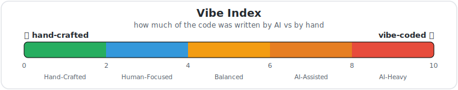

<p align="center">
    
</p>

<p align="center">✨ How hard does your repo vibe? ✨</p>

<div align="center">

<!-- vibe-index:start -->
[](https://github.com/roxblnfk/action-vibe-index)
<!-- vibe-index:end -->
[](https://github.com/marketplace/actions/vibe-index)
[](https://boosty.to/roxblnfk)

</div>

<br />

**Vibe Index** reads your git history and scores how much of your repo was
vibe‑coded by AI vs hand‑written by humans — then turns it into a badge you can
flex. The higher the score, the harder it vibes: **`0.0`** = every line crafted
by human hands, **`10.0`** = pure AI, top to bottom.

<p align="center">
  <picture>
    <source media="(prefers-color-scheme: dark)" srcset="docs/vibe-scale-dark.svg">
    <source media="(prefers-color-scheme: light)" srcset="docs/vibe-scale.svg">
    
  </picture>
</p>

## 🚀 Usage

Two steps: drop the markers where you want the badge, then run the action.

### 1. Add the markers to your README

```markdown
<!-- vibe-index:start --><!-- vibe-index:end -->
```

The action rewrites whatever is between the markers (an empty pair is fine). On
their own line you get a standalone badge; placed after other content they keep
the badge inline — so it also works inside a row of badges.

No markers? Drop this starter line where you want the badge and set
`badge-discovery: markdown` — the action finds it by its alt text and fills the
URL in place (the empty link is fine; it's replaced on the first run):

```markdown

```

With `auto` (the default) both the markers and the `` styles
work.

### 2. Run the action

```yaml
name: Vibe Index

on:
  push:
    branches: [main]
  schedule:
    - cron: '0 0 * * 0'  # refresh weekly

permissions:
  contents: write  # required to commit the refreshed badge

jobs:
  vibe-index:
    runs-on: ubuntu-latest
    steps:
      - uses: actions/checkout@v4
        with:
          fetch-depth: 0  # the action needs full git history

      - uses: roxblnfk/action-vibe-index@v1
        with:
          commit: true  # commit & push the updated badge in place
          push: true
```

That's it — the badge refreshes itself on every run.

> 💡 **Already have a release workflow?** Prefer adding a single Vibe Index step
> to it (e.g. right after your version bump) instead of a separate workflow, so
> the badge is refreshed as part of each release. There, leave `commit`/`push`
> off and let your existing commit step pick up the changed file.

## ⚙️ Configuration

Every option with its default — keep only what you need:

```yaml
- uses: roxblnfk/action-vibe-index@v1
  with:
    # ─── analysis ───
    commits-count: '500'          # how many recent (non-merge) commits to scan
    co-author-multiplier: '0.8'   # AI share of a co-authored commit, 0..1 (0.8 = 80% AI / 20% human)
    extra-bot-patterns: |         # extra regexes (one per line) matched against the commit
      @my-company-bot\.com        # author and Co-Authored-By identities, merged on top of the
      \bInternalLLM\b             # built-in AI/bot signatures (Claude, Copilot, [bot], …)

    # ─── badge look ───
    include-message: 'Vibe Index' # left-hand label text
    badge-style: 'flat-square'    # flat | flat-square | plastic | for-the-badge | social
    badge-color: 'auto'           # 'auto' = color from the green→purple gradient by score, or a fixed hex / named color
    badge-logo: 'sparkles'        # built-in 'sparkles' ✨, a simple-icons slug (e.g. 'github'), or '' for none
    badge-link: ''                # URL the badge links to (defaults to this repo); '' = no link

    # ─── where to write the badge ───
    update-files: 'README.md'     # comma/newline list of files to update; '' to disable
    badge-discovery: 'auto'       # how to find the badge to replace:
                                  #   auto     = markers, then an existing  image
                                  #   markers  = only the <!-- vibe-index:start/end --> markers
                                  #   markdown = only an existing  image
    badge-output-file: ''         # also write the raw badge URL to this file (optional)

    # ─── auto-commit (needs permissions: contents: write) ───
    commit: false                 # commit the updated files
    push: false                   # push the commit to the current branch
    commit-message: 'chore: update Vibe Index badge'
    commit-user-name: 'github-actions[bot]'
    commit-user-email: '41898282+github-actions[bot]@users.noreply.github.com'

    # ─── quality gate ───
    assert-index: ''              # fail the run if the score is outside this range, e.g. '0.0-6.0' (≤ 60% AI)
```

### Outputs

| Output | Description |
|--------|-------------|
| `vibe-index` | Score `0.0`–`10.0` |
| `ai-percentage` / `human-percentage` | Share of code lines by AI / by humans |
| `ai-commits-percentage` / `human-commits-percentage` | Share of commits by AI / by humans |
| `badge-url` | Generated shields.io badge URL |
| `badge-markdown` | Ready-to-paste markdown for the badge |

### Recipe: comment the score on every pull request

```yaml
- uses: roxblnfk/action-vibe-index@v1
  id: vibe
  with:
    update-files: ''  # don't touch files, just compute the score

- uses: actions/github-script@v7
  with:
    script: |
      github.rest.issues.createComment({
        issue_number: context.issue.number,
        owner: context.repo.owner,
        repo: context.repo.repo,
        body: `Vibe Index: ${{ steps.vibe.outputs.vibe-index }} / 10`
      });
```

## 🧠 How it works

### Detecting AI authorship

Detection is based on commit **identities** — the author `Name <email>` and any
`Co-Authored-By:` identities — matched against a curated list of signatures
(vendor email domains like `@anthropic.com`, GitHub App `[bot]` accounts, the
Copilot agent identity, …). It deliberately does **not** scan the free-text
message, so a human who merely mentions an AI tool, or who happens to be named
"Claude", is never misclassified.

The built-in list lives in [`src/bot-signatures.js`](src/bot-signatures.js) and
grows in new releases. Add tools specific to your team via `extra-bot-patterns`
(one regex per line) — they are merged on top of the built-in signatures.

### Classifying each commit

Merge commits are ignored. Every other commit falls into exactly one bucket:

- **AI** — the commit *author* identity is an AI/bot → counted fully as AI.
- **Co-authored** — a human author with an AI `Co-Authored-By:` identity →
  credit is split by `co-author-multiplier`, applied to **both** lines and the
  commit itself.
- **Human** — neither the author nor any co-author matches a signature.

Example with the default `co-author-multiplier: 0.8`:

```
100 changed lines
Co-Authored-By: Claude <noreply@anthropic.com>
```

→ 80 lines counted as AI, 20 as human; and the commit counts as 0.8 AI / 0.2 human.

### The score

```
Vibe Index = (ai_code_ratio × 0.6 + ai_commits_ratio × 0.4) × 10
```

Code lines weigh 60%, commit authorship 40%. Both ratios are in `0..1`, so the
score is always `0.0`–`10.0`:

| AI code | AI commits | Vibe Index |
|--------:|-----------:|:----------:|
| 0%   | 0%   | **0.0** — fully hand-written |
| 30%  | 30%  | **3.0** — human-focused |
| 50%  | 50%  | **5.0** — balanced |
| 100% | 100% | **10.0** — fully AI |

### Badge color

With `badge-color: auto` (the default) the color is interpolated along a
continuous green → festive purple ramp at the exact score
(`#27ae60 → #1abc9c → #3498db → #6c5ce7 → #8a2be2`) — green for hand-crafted,
purple for fully vibe-coded. Set a fixed hex or named color to opt out.

## 🐛 Troubleshooting

- **"Failed to get git commits"** — set `fetch-depth: 0` on `actions/checkout`,
  so the action sees the full history.
- **The badge doesn't update / isn't committed** — enable `commit: true`
  (and `push: true`) and grant `permissions: contents: write`, or commit the
  changed file with your own step.
- **The badge image doesn't render** — keep the marker pair on its own line; a
  line that starts with `<!--` is treated as raw HTML by GitHub, so the action
  writes the badge on its own line there.

